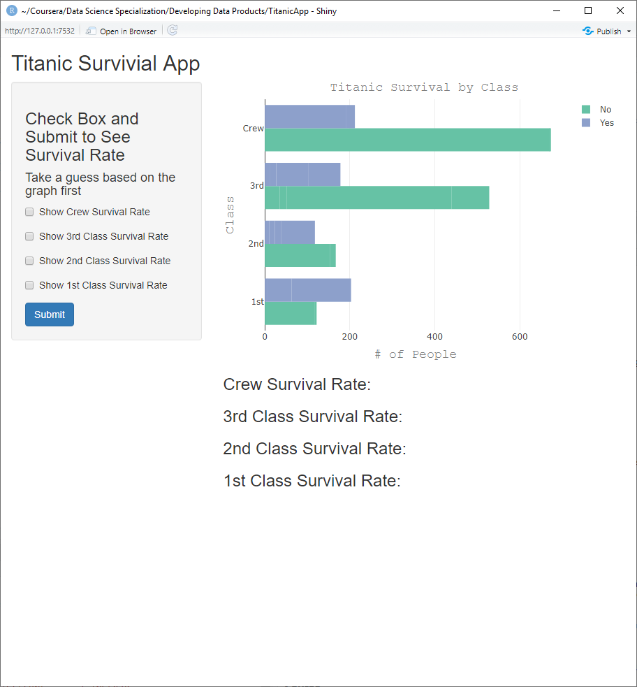

```{r setup, include=FALSE}
knitr::opts_chunk$set(echo = FALSE)
```

## My Titanic Survival Shiny App


My Titanic Survival App is a very simple app that uses the Titanic dataset from:  
  
`datasets(Titanic)`

The App has Check Boxes that will calculate the survival rate based on the 
class of passenger.

Take a Guess at which one you'd want to be before moving on: Crew, 3rd, 2nd or 1st Class?

## App Links

- [Google](http://www.google.com)
- [Titanic Shiny App](http://www.google.com)
- [GitHub Repo](http://www.google.com)

## App Screen Shot

{width=80%}


## Key Evaluated Code

```{r, eval=FALSE, echo=TRUE}

library(plotly)
library(dplyr)
data <- data.frame(Titanic)
dt <- aggregate(Freq~Class+Survived, data, sum)
output$plot <- renderPlotly({
    p <- plot_ly(data, x = data$Freq, y = data$Class, 
                 color = factor(data$Survived))
    p <- p %>% layout(title = "Titanic Survival by Class", titlefont = f)
    p <- p %>% layout(xaxis = list(title = '# of People', titlefont = f))
    p <- p %>% layout(yaxis = list(title = 'Class', titlefont = f))
    p  
})
output$crew <- renderText({
    if(input$crew){
        crewalive/(crewalive+crewdead)
    }
})
```

